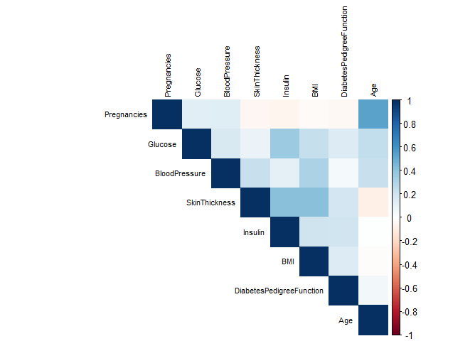
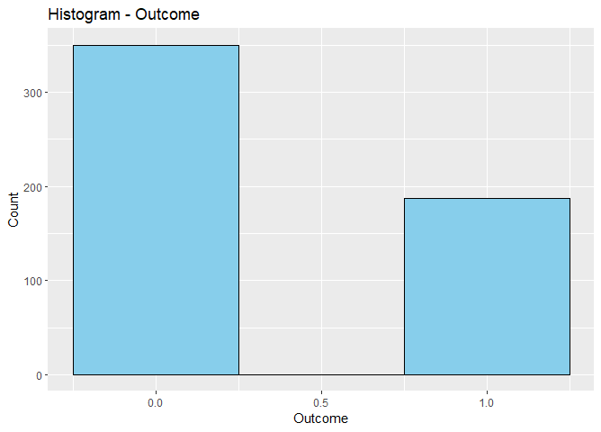
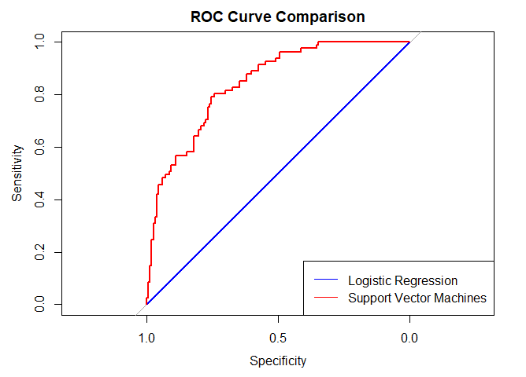

## Lojistik Regresyon
Lojistik regresyon, sınıflandırma problemlerinde kullanılan bir istatistiksel modeldir. Lojistik regresyon, bağımsız değişkenlerin verildiği durumlarda bir bağımlı değişkenin iki sınıfa ait olma olasılığını tahmin etmek için kullanılır. Örneğin, hasta/hasta olmayan, evet/hayır gibi iki sınıfı olan problemlerde sıklıkla tercih edilir. Lojistik regresyon çıktı olarak 0 ile 1 arasında olasılık değerleri verir ve bu değerlerin üzerine belirli bir eşik değeri uygulanarak sınıflandırma yapılabilir.

## Destek Vektör Makineleri (SVM)
Destek vektör makineleri, hem sınıflandırma hem de regresyon problemleri için kullanılan güçlü bir makine öğrenme algoritmasıdır. SVM, veri noktalarını sınıflandırmak veya bir çizgiye uygun bir şekilde oturtmak için kullanılır. SVM, verileri yüksek boyutlu uzayda temsil eder ve bu uzayda sınıflandırma yapabilmek için optimum bir hiperdüzlem bulmaya çalışır. Sınıflar arasındaki ayrımı maksimuma çıkarmak için destek vektörleri kullanır.

Şimdi, R programı kullanarak lojistik regresyon ve destek vektör makinelerini bir veri seti üzerinde karşılaştırma yapalım.

Bunun için kaggle'dan elde ettiğimiz Pima Kızılderilileri Diyabet Veritabanını kullanacağız.

Bu veri kümesi aslen Ulusal Diyabet ve Sindirim ve Böbrek Hastalıkları Enstitüsü'ndendir. Veri setinin amacı, veri setinde yer alan belirli teşhis ölçümlerine dayalı olarak bir hastanın diyabet hastası olup olmadığını teşhis amaçlı olarak tahmin etmektir. Buradaki tüm hastalar en az 21 yaşında Pima Kızılderili mirasına sahip kadınlardır.
Veri kümesi, 9 sütundan ve 768 gözlemden oluşmaktadır. Veri setini anlamak için sütunlarımızı tanımlayalım.

- Pregnancies : Hamile kalma sayısı

- Glucose : Oral glukoz tolerans testinde 2 saatlik plazma glukoz konsantrasyonu

- BloodPressure : Diyastolik kan basıncı (mm Hg)

- SkinThickness : Triceps deri kıvrım kalınlığı (mm)

- Insulin : 2 saatlik serum insülini (mu U/ml)

- BMI : Vücut kitle indeksi 

- DiabetesPedigreeFunction : Diyabet soy ağacı işlevi

- Age : Yaş

- Outcome : Sınıf değişkeni (0 veya 1) 768'den 268'i 1, diğerleri 0


Şimdi verimizi R'ye aktaralım ve ilk birkaç gözleme bakalım.


```{r}
diabetes_data <- read.csv("diabetes.csv")
head(diabetes_data)
```

Veri setimizin yapısal özelliklerine bakalım.

```{r}
str(diabetes_data)
```

Veri setimizin özet istatistiklerini görüntüleyelim.

```{r}
summary(diabetes_data)
```

Makine öğrenimi modellerini eğitmek ve performansını değerlendirmek için eğitim ve test veri setleri oluşturalım.

```{r}
set.seed(123)
train_indices <- sample(1:nrow(diabetes_data), 0.7 * nrow(diabetes_data))
train_data <- diabetes_data[train_indices, ]
test_data <- diabetes_data[-train_indices, ]
```

Bağımsız değişkenler arasındaki korelasyonu görmek için bir korelasyon matrisi çizdirelim. 

```{r}
library(corrplot)
cor_matrix <- cor(train_data[, -9])
corrplot(cor_matrix, method = "color", type = "upper", tl.cex = 0.7, tl.col = "black")
```



Grafikteki karelerin renkleri, değişkenler arasındaki korelasyonun gücünü temsil etmektedir. Koyu mavi renk negatif korelasyonu, kırmızı renk ise pozitif korelasyonu ifade etmektedir. Renk skalasında beyaz renk ise korelasyonun zayıf veya yok olduğunu göstermektedir. Pozitif korelasyon, iki değişken arasında birlikte artma veya birlikte azalma eğilimini ifade eder. Negatif korelasyon, iki değişken arasında birlikte ters yönlü hareket etme eğilimini ifade eder.

Veri setimizdeki şeker hastası ve sağlıklı bireylerin dağılımına bakalım.

```{r}
library(ggplot2)
ggplot(train_data, aes(x = Outcome)) +
  geom_histogram(binwidth = 0.5, fill = "skyblue", color = "black") +
  labs(x = "Outcome", y = "Count", title = "Histogram - Outcome")
```



Lojistik Regresyon modelimizi oluşturalım. Burada 'glmnet' paketini kullanacağız. glmnet paketi, istatistiksel modelleme ve makine öğrenimi alanında sıkça kullanılan bir araçtır. Hem regresyon hem de sınıflandırma problemleri için kullanılabilir ve değişken seçimi ve regülarizasyon gibi önemli konuları ele alırken, modelin performansını artırmaya yardımcı olur.

```{r}
library(glmnet)

# Bağımlı değişkeni ve bağımsız değişkenleri ayırma
y_train <- train_data$Outcome
x_train <- train_data[, -9]

# Veriyi standartlaştırma
x_train <- scale(x_train)

# Lojistik regresyon modelini oluşturma
model_logit <- glmnet(x_train, y_train, family = "binomial", alpha = 1)
```

Şimdi ise Destek Vektör Makineleri modelimizi oluşturalım. bunun için 'e1071' paketini kullanacağız. e1071 paketi, hem akademik araştırmalarda hem de endüstriyel uygulamalarda destek vektör makineleri yöntemini kullanmak isteyen kullanıcılara kolaylık sağlar. Veri sınıflandırma ve regresyon problemlerini çözmek için güçlü ve esnek bir araç sunar.

```{r}
library(e1071)

# Destek vektör makineleri modelini oluşturma
model_svm <- svm(Outcome ~ ., data = train_data, kernel = "linear", probability = TRUE)
```

Burada oluşturduğumuz modelleri kullanarak test veri seti üzerinde tahmin yapalım. Aynnı zamanda lojistik regresyon tahminlerinin uzunluğunu test veri setinin 'Outcome' sütununun uzunluğuna ayarlayalım.

```{r}
# Test veri seti üzerinde tahmini
x_test <- test_data[, -9]

# Lojistik regresyon ile tahmini
x_test_scaled <- scale(x_test)
predicted_logit <- predict(model_logit, newx = x_test_scaled, type = "response")

# Destek vektör makineleri ile tahmini
predicted_svm <- predict(model_svm, newdata = x_test, probability = TRUE, type = "response")

# predicted_logit uzunluğunu test_data$Outcome uzunluğuna ayarla
predicted_logit <- predicted_logit[1:length(test_data$Outcome)]
```

Şimdi ise oluşturduğumuz lojistik regresyon ve destek vektör makineleri modelleri için ROC eğrilerini çizdirelim. ROC (Receiver Operating Characteristic) eğrisi, bir sınıflandırma modelinin performansını değerlendirmek için kullanılan bir grafiksel araçtır. Özellikle ikili sınıflandırma problemlerinde yaygın olarak kullanılır.

```{r}
library(pROC)
roc_logit <- roc(test_data$Outcome, predicted_logit)
roc_svm <- roc(test_data$Outcome, predicted_svm)

plot(roc_logit, col = "blue", main = "ROC Curve Comparison")
lines(roc_svm, col = "red")
legend("bottomright", legend = c("Logistic Regression", "Support Vector Machines"), col = c("blue", "red"), lty = 1)
```



Son olarak AUC değerlerine göz atalım. AUC değeri, ROC eğrisinin altında kalan alanı ifade eder ve bir sınıflandırma modelinin performansını ölçmek için kullanılır.

```{r}
# AUC değerlerini elde etmek için
auc_logit <- auc(roc_logit)
auc_svm <- auc(roc_svm)

# Modellerin karşılaştırmasını yapmak için AUC değerlerini yazdır
print(paste("Logistic Regression AUC:", auc_logit))
print(paste("Support Vector Machines AUC:", auc_svm))
```

Bu durumda, lojistik regresyon modeli için AUC değeri 0.5 olarak görünüyor, yani model rasgele tahmin yapmaktan daha iyi bir performans sergilemiyor. Diğer yandan, destek vektör makineleri (SVM) modeli için AUC değeri 0.840576131687243 olarak hesaplanmış. Bu durumda SVM modelinin, rasgele tahmin yapmaktan daha iyi bir performans sergilediği söylenebilir.

AUC değeri, bir modelin sınıflandırma performansını ölçen ve 1'e yaklaştıkça daha iyi performansı gösterdiğini gösteren bir metriktir. Dolayısıyla, SVM modelinin AUC değerinin 0.84 olması, modelin iyi bir ayrımcı yetenek sergilediğini ve veri setindeki hastaların şeker hastası olup olmadığını daha doğru bir şekilde tahmin ettiğini göstermektedir.


### Referanslar : 
[DİYABET VERİ SETİ](https://www.kaggle.com/datasets/uciml/pima-indians-diabetes-database)
